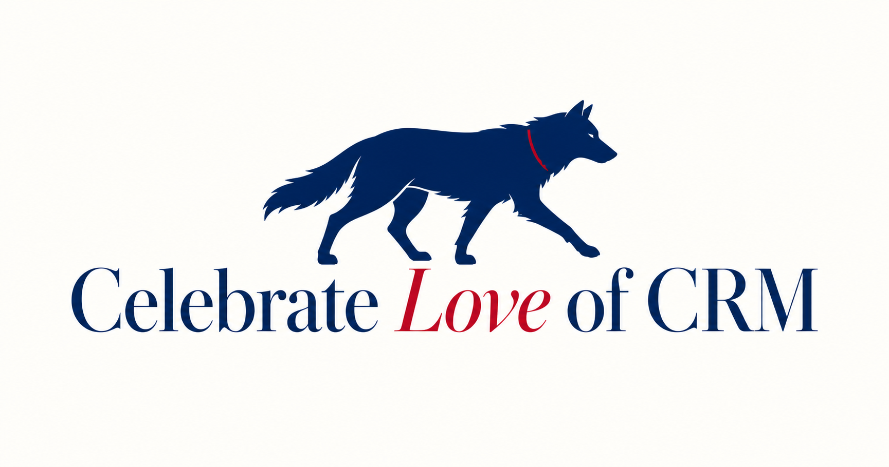

# FREE CRM



**FREE CRM, FREE FOR ALL, FREE FOREVER.**

FREE CRM is an open-source customer operating system built for solopreneurs. It joins relationship context, selling, delivery, billing, support, documents, automation, and reporting in one private workspace—with no subscription and no AI API key.

[](https://deploy.workers.cloudflare.com/?url=https://github.com/mlmrx/FreeCRM)

The home route opens with the “Celebrate *Love* of CRM” wolf experience; the complete customer workspace lives at `/workspace` and is also the installed PWA start screen.

This is an original clean-room project inspired by the broad category of personal CRM products. It is not affiliated with YouSpot, HubSpot, or any connector provider.

## What is real today

| Area | Working capabilities |
| --- | --- |
| Relationships | Leads, contacts, companies, conversion, lifecycle, tags, sources, edit/archive, and cross-module Customer 360 |
| Sales | Opportunity board, probabilities, stage progression, products, quotes, quote-to-invoice conversion, invoices, and payments |
| Work | Activities, tasks, priorities, calendar export, durable notes/timeline, and R2-backed document upload/download/delete |
| Growth & service | Campaign records, support tickets, resolution history, and customer linkage |
| Intelligence | Live pipeline, weighted forecast, revenue, lead source, activity, task, invoice-aging, and support analytics |
| Automation | Trigger/condition/action workflow rules, atomic task creation, enable/pause controls, and run history |
| Integrations | CSV and JSON portability, ICS calendar export, authenticated inbound webhook, outbound webhook configuration, and honest provider states |
| Administration | Identity-derived workspaces, roles, settings, health, immutable audit events, outbox, idempotency, backups, and clean/demo reset |

The demo workspace is one coherent lead-to-cash story. It proves the full path from lead and meeting through opportunity, quote, invoice, payment, document, ticket, campaign, workflow, and Customer 360. **Start clean** removes demo CRM data when you are ready.

## Architecture

```text
Authenticated PWA
      │
      ├── /api/v1/bootstrap, commands, exports, files, calendar, webhooks
      │
      ▼
Request identity → workspace membership → runtime validation
      │
      ├── Control plane
      │     workspace · modules · workflows · integrations · jobs · audit
      │
      └── Data plane
            records · links · notes · analytics · Customer 360
                  │
                  ├── D1: relational records, tenant fences, audit, outbox
                  └── R2: workspace-prefixed document bytes
```

The first release deliberately uses one physical D1 database with logical control-plane and data-plane boundaries. That preserves atomic business writes and single-click deployment. Every business query is workspace-scoped, record relationships use composite workspace foreign keys, and every command writes its domain mutation, audit event, outbox event, and idempotency response in one D1 batch.

Key production properties:

- The signed-in identity determines the workspace; request bodies cannot choose a tenant.
- Optimistic record versions reject stale updates with `409 Conflict`.
- `Idempotency-Key` makes retried and concurrent mutations safe.
- Money is stored as integer cents in one workspace reporting currency.
- Audit snapshots omit message bodies, contact fields, connector configuration, tokens, and secrets.
- API and authenticated HTML are never cached by the service worker.
- CSV exports neutralize spreadsheet formulas.
- Uploaded files are limited to an allowlist and 10 MB, and R2 keys are workspace-prefixed.
- OAuth providers are never presented as connected before real credentials and consent exist.

The relational schema is in [`db/schema.ts`](db/schema.ts), generated migrations are in [`drizzle/`](drizzle/), and the command boundary is in [`server/commands.ts`](server/commands.ts).

## One-click device launch

This path needs no cloud account, deployment token, OAuth client, or third-party API key.

Requirements: [Node.js 22.13+](https://nodejs.org/).

### Windows

Double-click `START-FREE-CRM.cmd`.

### macOS or Linux

```sh
chmod +x scripts/start-local.sh
./scripts/start-local.sh
```

The launcher installs dependencies on first use, applies pending D1 migrations, opens `http://localhost:3477`, and keeps D1/R2 state under `.wrangler/state`. A fixed local owner controls the loopback-only device workspace. Keep that directory in backups if you use the device deployment as your system of record.

## One-command container

Docker also needs no cloud credentials.

```sh
docker compose up --build
```

Open `http://localhost:3477`. Compose binds only to loopback; the named `free-crm-data` volume persists D1 and R2 state across container replacements.

## Cloud deployment

Open the in-product **Deployment Center** at `/deploy`, or use one of these paths:

### Cloudflare account

The deploy button clones the repository into your Git provider and provisions one Worker, D1 database, and private R2 bucket in your Cloudflare account. The first deployment is sealed until you protect all Worker traffic with Cloudflare Access and configure its team domain, application audience, and exact owner email.

For a guided terminal setup:

```sh
git clone https://github.com/mlmrx/FreeCRM.git
cd FreeCRM
npm ci
npx wrangler login
npm run deploy:cloudflare
```

With `CLOUDFLARE_API_TOKEN`, `CLOUDFLARE_ACCOUNT_ID`, and `FREE_CRM_OWNER_EMAIL` in the process environment, the installer creates or strictly audits one exact-owner Access policy. It deploys locked first, verifies D1 installation provenance and private R2 settings, keeps the token out of files and builds, and activates only after policy read-back succeeds.

### Protected GitHub releases

The manual **Deploy FREE CRM** workflow requires all three credentials from a `cloudflare-production` GitHub Environment, runs the complete release suite, proves resource ownership, applies migrations, audits and activates Access, and reports success only after unauthenticated denial is verified. It does not run with pull-request secrets.

### OpenAI Sites

The repository remains configured for OpenAI Sites in [`.openai/hosting.json`](.openai/hosting.json). A Sites deployment provisions:

- `DB` — Cloudflare D1
- `FILES` — Cloudflare R2
- a private identity gateway that supplies trusted authenticated-user headers

Builds package the forward-only Drizzle migrations automatically. Direct Cloudflare deployments use cryptographically verified Access JWTs and reject spoofed Sites identity headers.

Read the complete credential, Access, webhook, backup, VM, and recovery guide in [`docs/CLOUD_DEPLOYMENT.md`](docs/CLOUD_DEPLOYMENT.md).

Third-party infrastructure can have usage limits or costs. The code, device deployment, data model, and no-subscription product remain MIT licensed forever.

## Integrations: honest by default

CSV import/export and ICS export work without credentials. The inbound webhook works only when `FREE_CRM_WEBHOOK_KEY` is configured. Generic webhook/Zapier destinations accept HTTPS URLs and remain **configured**, not falsely **connected**. Destination URLs reject embedded usernames, passwords, fragments, and credential-like query parameters; keep connector secrets in provider secret stores.

Google Workspace, Microsoft 365, and Slack are adapter entries that require your own reviewed OAuth application, least-privilege scopes, callback configuration, and consent before connection. FREE CRM does not ship shared third-party credentials or simulate an OAuth success state.

For local webhook testing:

```sh
copy .env.example .env.local
# set a long random FREE_CRM_WEBHOOK_KEY, then restart FREE CRM
```

## Development

```sh
npm ci
npm run dev
```

Useful commands:

```sh
npm run db:generate       # generate a forward migration after schema changes
npm run db:local:migrate  # apply migrations to local D1
npm run lint
npm run typecheck
npm run security:secrets # scan every tracked file without printing matched values
npm run test:coverage
npm run test:db
npm run db:check
npm run build
npm run smoke:api         # run while the app is available at localhost:3481
npm run check             # the complete non-server release gate
```

The test suite covers domain analytics, validation boundaries, CSV injection, migrations, foreign-key integrity, cross-tenant relationship fences, indexed query plans, build/type/lint correctness, and a live HTTP canary for identity, D1, R2, idempotency, stale writes, exports, calendar, security headers, and fail-closed webhooks.

## Local v1 data

Existing browser-only FREE CRM v1 data is never discarded. When detected, the product offers an explicit bounded import into the durable workspace. Imported records are validated through the same command boundary and the original browser copy remains untouched until you remove it yourself.

## Data ownership and limitations

- A cloud or container workspace stores CRM data server-side so it can survive refreshes and support multiple devices. It is not browser-only storage.
- Local `.wrangler/state`, JSON backups, CSV exports, and downloaded documents can contain sensitive customer data; protect them accordingly.
- FREE CRM is optimized for one owner and one reporting currency today. The schema includes memberships and roles, but multi-user invitations and currency conversion are intentionally not presented as finished features.
- Connector delivery workers and provider-specific OAuth clients belong in reviewed adapters; configured destinations are not labeled as synchronized until a real job succeeds.
- FREE CRM does not autonomously send customer communications or move money.

See [SECURITY.md](SECURITY.md) before exposing a fork publicly and [CONTRIBUTING.md](CONTRIBUTING.md) before opening a change.

## License

MIT. Your copy and your data remain yours.
